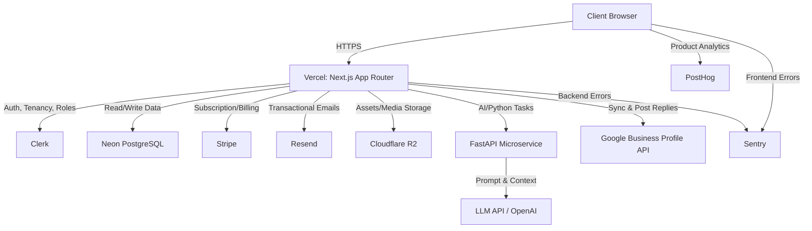

# Architecture: Smart MEO Manager

## System Overview
Smart MEO Manager is a B2B SaaS designed to streamline Google Business Profile (GBP) operations. The platform targets restaurant operators, multi-location businesses, and MEO agencies. It centralizes review management, provides AI-drafted responses (with mandatory human approval), manages reply templates, and offers comprehensive KPIs and MEO analysis per location. 

A core system constraint is that **automatic replies are strictly prohibited**. All responses, whether generated by AI or selected from a template, must go through a human approval workflow before being published to Google.

## Mermaid Diagram

## Frontend Architecture
- **Framework:** Next.js with App Router.
- **UI & Styling:** Tailwind CSS combined with shadcn/ui for consistent, accessible, and highly customizable UI components.
- **State Management & Data Fetching:** React Server Components (RSC) are used by default for data fetching and rendering. Client Components (`"use client"`) are strictly limited to interactive components (e.g., filters, reply editors, dashboards).
- **Package Manager:** `pnpm` is strictly enforced for dependency management to ensure fast, deterministic builds.

## Backend Architecture
- **Core Backend:** Next.js Server Actions and Route Handlers manage core business logic, database mutations, and external API orchestrations.
- **ORM:** Prisma Client is used for type-safe database queries and schema migrations.
- **Python Microservice:** FastAPI is utilized *only* for Python-required workloads, such as running specific NLP libraries, heavy data processing, or interfacing with complex AI frameworks for draft generation. It exposes internal REST APIs consumed by the Next.js backend.
- **Background Processes:** Scheduled syncing of reviews and analytics from the GBP API.
- **Safeguards:** The posting mechanism to the GBP API contains a hard validation check ensuring `isApprovedByHuman === true`.

## Data Architecture
- **Database:** Neon (Serverless PostgreSQL) enabling fast branching for preview environments.
- **Storage:** Cloudflare R2 for storing static assets, generated report exports, and user-uploaded media.
- **Core Entities (Prisma Schema Overview):**
  - `Tenant` (Mapped to Clerk Organization ID)
  - `Location` (Connected to GBP locations, belongs to Tenant)
  - `Review` (Synced from GBP, belongs to Location)
  - `Reply` (Tracks draft status, AI-generated text, and human approval state)
  - `Template` (Pre-defined text blocks belonging to a Tenant)
  - `MEOAnalytics` (Time-series data for KPI dashboards)

## Auth and Billing Boundaries
- **Authentication & Tenancy:** Handled entirely by Clerk.
  - **Organizations:** Clerk Organizations are used as the primary tenant boundary. All database queries must be scoped to the active Clerk `org_id`.
  - **Roles:**
    - `ADMIN`: Full access. Can manage billing, connect GBP accounts, approve replies, and manage templates.
    - `MEMBER`: Operational access. Can generate AI drafts, approve replies, and view dashboards.
    - `READONLY`: Reporting access. Can view KPI dashboards, MEO analysis, and review lists, but cannot modify or approve anything.
- **Billing:** Handled by Stripe.
  - Subscriptions are linked to the Clerk Organization (Tenant), not individual users.
  - Webhooks from Stripe sync subscription status/tiers to the Neon database to gate features (e.g., number of locations, AI generation limits).

## Integrations
- **Google Business Profile API:** The critical integration for fetching locations, pulling reviews, and publishing approved replies. Requires handling OAuth refresh tokens securely.
- **FastAPI / LLMs:** Dedicated to generating contextual reply drafts based on the review content, rating, and organization's historical tone.
- **Resend:** Used for system notifications, such as alerting `ADMIN` or `MEMBER` roles when a burst of negative reviews occurs or when drafts are pending approval.
- **PostHog:** Integrated for user behavior analytics, dashboard usage tracking, and feature flagging.
- **Sentry:** Configured across Next.js (client/server) and FastAPI for full-stack error tracking and performance monitoring.

## Deployment
- **Main Application:** Deployed on **Vercel**, taking advantage of Edge Network, Next.js optimizations, and preview deployments.
- **Database:** **Neon PostgreSQL** paired with Vercel for automated database branching on Pull Requests.
- **Python Microservice:** **FastAPI** application deployed on a containerized platform (e.g., Google Cloud Run, Render, or Fly.io). Must be secured via internal network rules or a shared secret so it is only accessible by the Vercel backend.

## Open Questions
- **GBP API Rate Limiting:** How do we handle quota limits and exponential backoff when syncing data for tenants with hundreds of locations?
- **Sync Strategy:** Should we rely on polling (e.g., hourly cron jobs) or configure Google Pub/Sub webhooks for real-time review ingestion?
- **Historical Data:** How far back (e.g., 6 months, 1 year, or all-time) should we sync historical reviews and insights when a new tenant connects their GBP account?
- **Service Security:** What is the preferred authentication mechanism between the Vercel Serverless environment and the FastAPI microservice?
